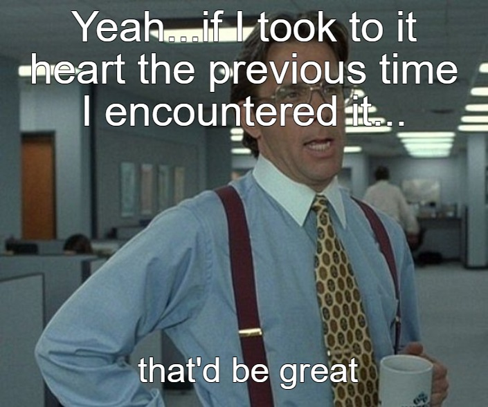

When I first started my career there was a senior developer in my onboarding cohort. One day we were chatting about debugging (fascinating right?) and he said something that stuck with me ever since.

> If the code didn't change then the cause must be config or environment.

Even though I agreed with him at the time I didn't really take it into heart until today. It's one of those things you don't truly appreciate until you experience it yourself.

